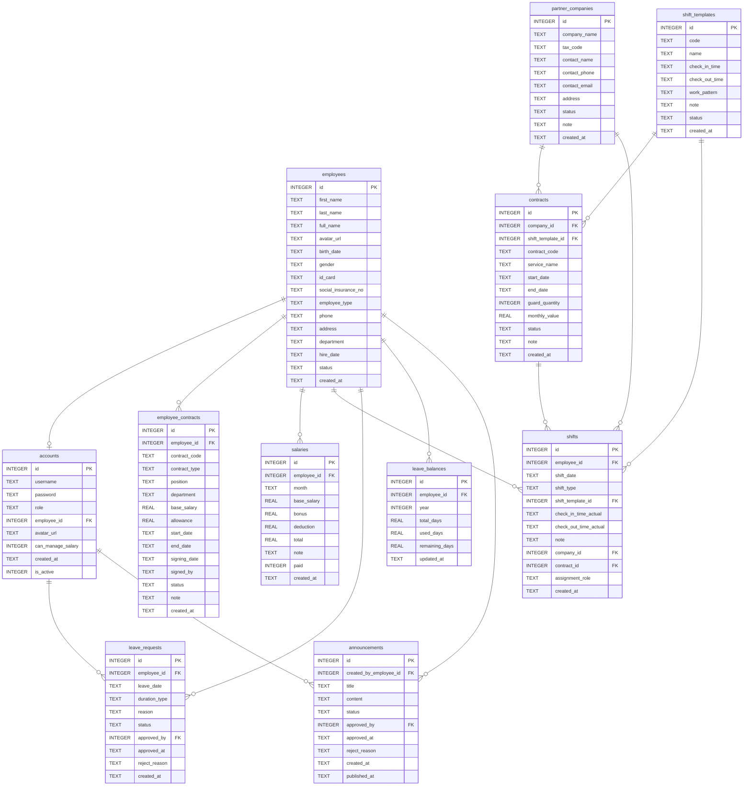

# DoAn3M - Sơ đồ quan hệ Database (ERD)

> Nhấn `Ctrl + Shift + V` để xem sơ đồ.

```mermaid
erDiagram

    employees {
        INTEGER id PK
        TEXT first_name
        TEXT last_name
        TEXT full_name
        TEXT avatar_url
        TEXT birth_date
        TEXT gender
        TEXT id_card
        TEXT social_insurance_no
        TEXT employee_type
        TEXT phone
        TEXT address
        TEXT department
        TEXT hire_date
        TEXT status
        TEXT created_at
    }

    accounts {
        INTEGER id PK
        TEXT username
        TEXT password
        TEXT role
        INTEGER employee_id FK
        TEXT avatar_url
        INTEGER can_manage_salary
        TEXT created_at
        INTEGER is_active
    }

    employee_contracts {
        INTEGER id PK
        INTEGER employee_id FK
        TEXT contract_code
        TEXT contract_type
        TEXT position
        TEXT department
        REAL base_salary
        REAL allowance
        TEXT start_date
        TEXT end_date
        TEXT signing_date
        TEXT signed_by
        TEXT status
        TEXT note
        TEXT created_at
    }

    salaries {
        INTEGER id PK
        INTEGER employee_id FK
        TEXT month
        REAL base_salary
        REAL bonus
        REAL deduction
        REAL total
        TEXT note
        INTEGER paid
        TEXT created_at
    }

    partner_companies {
        INTEGER id PK
        TEXT company_name
        TEXT tax_code
        TEXT contact_name
        TEXT contact_phone
        TEXT contact_email
        TEXT address
        TEXT status
        TEXT note
        TEXT created_at
    }

    shift_templates {
        INTEGER id PK
        TEXT code
        TEXT name
        TEXT check_in_time
        TEXT check_out_time
        TEXT work_pattern
        TEXT note
        TEXT status
        TEXT created_at
    }

    contracts {
        INTEGER id PK
        INTEGER company_id FK
        INTEGER shift_template_id FK
        TEXT contract_code
        TEXT service_name
        TEXT start_date
        TEXT end_date
        INTEGER guard_quantity
        REAL monthly_value
        TEXT status
        TEXT note
        TEXT created_at
    }

    shifts {
        INTEGER id PK
        INTEGER employee_id FK
        TEXT shift_date
        TEXT shift_type
        INTEGER shift_template_id FK
        TEXT check_in_time_actual
        TEXT check_out_time_actual
        TEXT note
        INTEGER company_id FK
        INTEGER contract_id FK
        TEXT assignment_role
        TEXT created_at
    }

    leave_requests {
        INTEGER id PK
        INTEGER employee_id FK
        TEXT leave_date
        TEXT duration_type
        TEXT reason
        TEXT status
        INTEGER approved_by FK
        TEXT approved_at
        TEXT reject_reason
        TEXT created_at
    }

    leave_balances {
        INTEGER id PK
        INTEGER employee_id FK
        INTEGER year
        REAL total_days
        REAL used_days
        REAL remaining_days
        TEXT updated_at
    }

    announcements {
        INTEGER id PK
        INTEGER created_by_employee_id FK
        TEXT title
        TEXT content
        TEXT status
        INTEGER approved_by FK
        TEXT approved_at
        TEXT reject_reason
        TEXT created_at
        TEXT published_at
    }

    employees ||--o| accounts : ""
    employees ||--o{ employee_contracts : ""
    employees ||--o{ salaries : ""
    employees ||--o{ shifts : ""
    employees ||--o{ leave_requests : ""
    employees ||--o{ leave_balances : ""
    employees ||--o{ announcements : ""

    accounts ||--o{ leave_requests : ""
    accounts ||--o{ announcements : ""

    partner_companies ||--o{ contracts : ""
    partner_companies ||--o{ shifts : ""

    shift_templates ||--o{ contracts : ""
    shift_templates ||--o{ shifts : ""

    contracts ||--o{ shifts : ""
```
